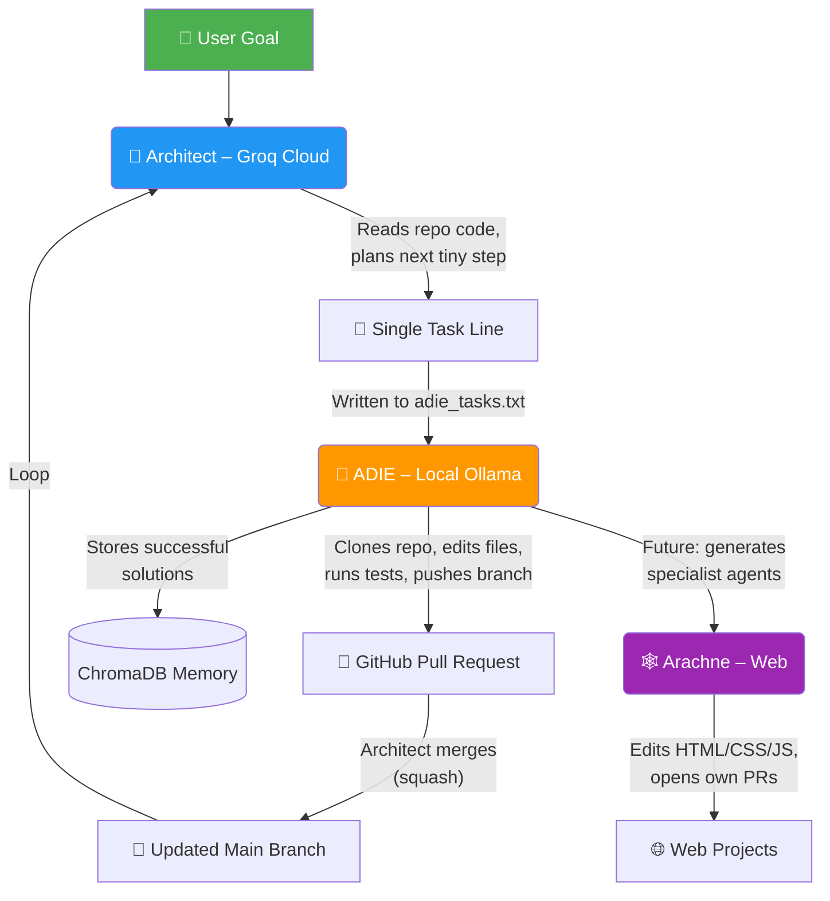

# 🤖 AI Agent Orchestrator

A self‑improving multi‑agent system that autonomously designs, codes, and maintains software projects – 24/7.

- **ADIE** – the mother agent that writes, tests, and pushes code changes.  
- **Architect** – the high‑level planner that breaks complex goals into tiny, safe tasks.  
- **Specialist Agents** – domain‑specific coding agents (first born: **Arachne** the web weaver).

All agents collaborate via GitHub pull requests, with zero human intervention after a goal is set.

---

## 🧠 Architecture



- **All changes land in feature branches** – `main` is never directly pushed to.  
- A **memory bank** (ChromaDB) helps ADIE learn from past successes.  
- **Controlled internet access** can fetch documentation when needed.  

---

## ✨ Features

- **Autonomous 24/7 operation** – set a goal and walk away.  
- **Incremental & safe** – every change is a tiny, testable PR.  
- **Multi‑domain capable** – the same architecture can build web apps, embedded firmware, or FPGA designs.  
- **Self‑improving** – ADIE can create and maintain her own specialist agents.  
- **Fully auditable** – every decision traces back to a PR and a git history.  
- **Runs on consumer hardware** – local LLM inference is powered by a **single NVIDIA RTX 4050 (6 GB VRAM)**.

---

## 🛠 Technology Stack

| Layer | Technology |
|-------|------------|
| **Hardware** | NVIDIA GeForce RTX 4050 (6 GB GDDR6) |
| **Local code generation** | [Ollama](https://ollama.com) + `deepseek-coder:6.7b-instruct` |
| **Cloud planning / orchestration** | [Groq API](https://groq.com) (`llama-3.3-70b-versatile`) |
| **Vector memory** | [ChromaDB](https://www.trychroma.com/) + `all-MiniLM-L6-v2` |
| **Git automation** | [GitHub CLI](https://cli.github.com/) (`gh`) |
| **Language** | Python 3.12+ |

> 📌 The local model runs entirely on the RTX 4050 with Q4_K_M quantization, leaving headroom for context.  
> The cloud planner uses Groq’s free tier and can be replaced with OpenAI / Anthropic if desired.

---

## 🚀 Getting Started

### 1. Clone the repository

```bash
git clone https://github.com/ryan7302/ai-agent-orchestrator.git
cd ai-agent-orchestrator
python -m venv venv && source venv/bin/activate
pip install -r requirements.txt
```

### 2. Set up credentials

```bash
# GitHub CLI
gh auth login

# Groq API key (free tier)
export GROQ_API_KEY="gsk_yourkey"
```

### 3. Start the system

**Terminal 1 – ADIE (the mother agent):**
```bash
python ADIE.py daemon --config adie_project.json --tasks adie_tasks.txt
```

**Terminal 2 – Architect (the planner):**
```bash
python architect.py
```

Write your goal in `goal.txt`, e.g.:

```
Extend the Arachne web specialist agent to: handle test commands from config,
retry on test failure, use proper web-specific file validation, support {url: ...}
for documentation fetching, and fully replicate ADIE's daemon functionality.
```

Now watch the loop run – Architect will generate tiny tasks, ADIE will execute them, and PRs will appear on GitHub.

---

## 📁 Project Structure

```
ai-agent-orchestrator/
├── ADIE.py                # Mother agent (code generation + daemon)
├── architect.py           # High‑level planner (orchestrator)
├── git_manager.py          # Safe Git operations wrapper
├── adie_project.json       # Example configuration
├── goal.txt                # Current high‑level goal
├── adie_tasks.txt          # Feed of incremental tasks
├── requirements.txt        # Python dependencies
└── README.md               # This file
```

Other files (workspaces, logs, memory) are generated at runtime and not committed.

---

## 📈 Status and Roadmap

| Milestone | Status |
|-----------|--------|
| ADIE – interactive single‑task mode | ✅ Complete |
| ADIE – 24/7 daemon mode | ✅ Complete |
| Architect – cloud‑powered planning loop | ✅ Complete |
| Arachne – web specialist agent | 🚧 In progress (being built by ADIE) |
| Hephaestus – embedded/Arduino specialist | ⏳ Planned |
| Prometheus – FPGA/VHDL specialist | ⏳ Planned |
| Full multi‑agent self‑improvement | ⏳ Planned |

---

## 🤝 Contributing

This is a personal portfolio project, but ideas and suggestions are welcome! Feel free to open an issue.

---

## 📄 License

MIT License – see [LICENSE](LICENSE) for details.

---

*Built with ambition, not sleep.*
